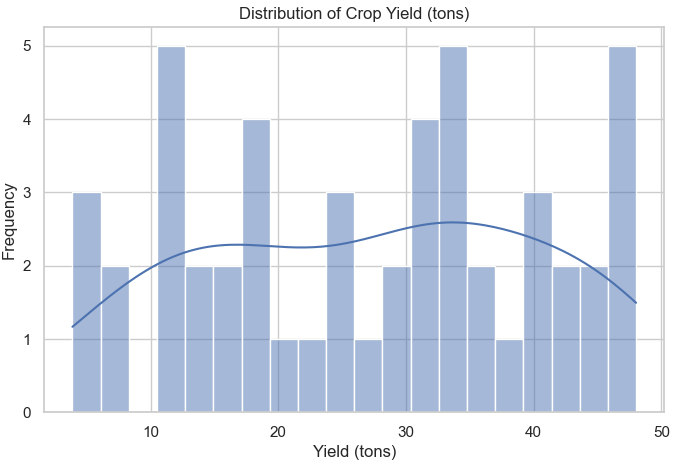
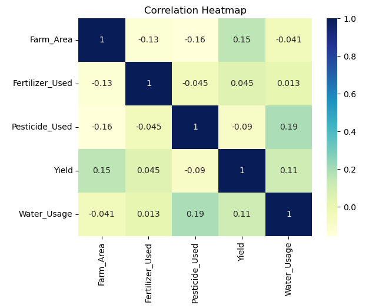
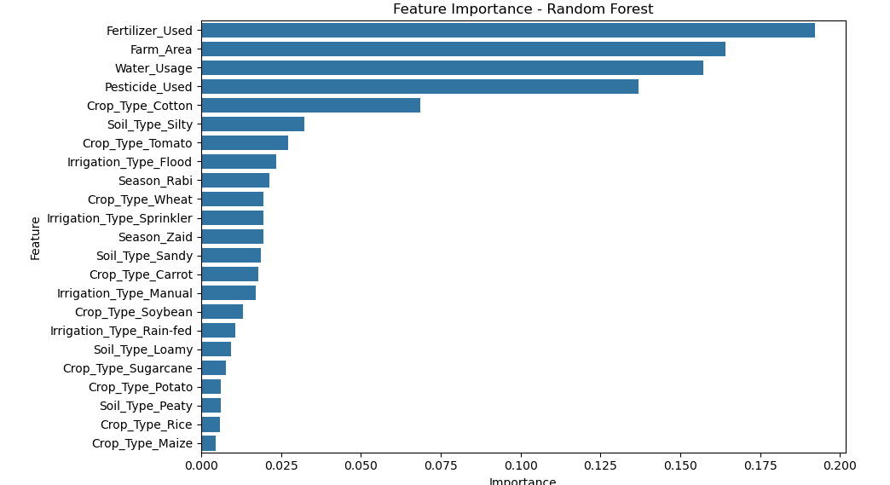

# Agriculture and Farming Data Analytics  

This project analyzes agricultural and farming data to uncover insights about crop yield, irrigation methods, soil types, fertilizer usage, and water consumption. The analysis applies **Python data science libraries** and **machine learning techniques** to identify patterns and build predictive models.  

## Project Objectives  
- Explore agricultural data using **pandas**, **numpy**, and **matplotlib/seaborn**.  
- Perform **data preprocessing** and apply **linear regression models**.    
- Visualize findings to provide meaningful insights for agricultural planning.  

## Dataset  
The dataset (`agriculture_dataset.csv`) contains information about:  
- **Farm Area (acres)**  
- **Crop Type**  
- **Irrigation Type**  
- **Fertilizer Used (tons)**  
- **Pesticide Used (kg)**  
- **Yield (tons)**  
- **Soil Type**  
- **Season**  
- **Water Usage (cubic meters)**  

## Visualizations  

### 1. Distribution of Crop Yield  
A histogram with KDE showing the distribution of crop yields (tons).
  

### 2. Correlation Heatmap
A heatmap showing correlations between farm area, fertilizer, pesticide, yield, and water usage.  
  

### 3. Feature Importance (Random Forest Model)
A bar chart highlighting the most important features affecting crop yield using Random Forest.
  

